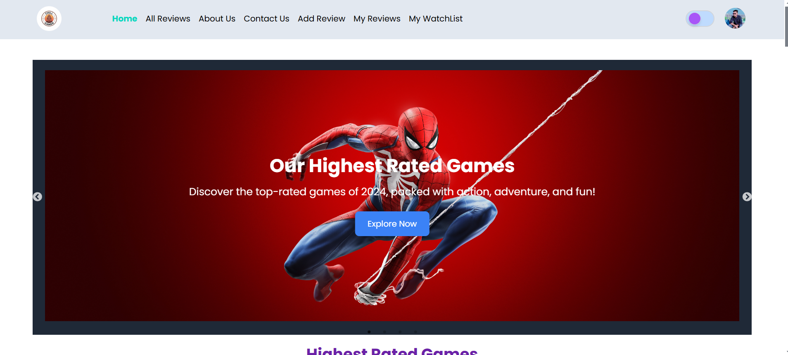

# Chill Gamer: A Game Review Application

## Project Overview


Chill Gamer is a user-friendly game review platform that allows users to explore, share, and manage game reviews. The application provides a seamless experience with features like user authentication, review management, and a personalized watchlist. Designed for simplicity and responsiveness, Chill Gamer ensures a "chill" experience for gamers on all devices.

---

## Key Features

1. **User Authentication:**

   - Email and password-based authentication.
   - Google login integration.
   - Secure user session management.

2. **Home Page:**

   - Banner/slider with meaningful information.
   - Highest-rated game section showcasing six top-rated games.
   - Two additional sections with relevant content.

3. **Review Management:**

   - Add, update, and delete reviews.
   - View all user-submitted reviews.
   - Filter and sort reviews by genre, rating, and publishing year.

4. **Game Watchlist:**

   - Save games to a personal watchlist.
   - Manage watchlist entries.

5. **Responsive Design:**

   - Optimized for mobile, tablet, and desktop views.

6. **Advanced Features:**

   - Dark/light theme toggle.
   - Loading spinners for data fetch states.
   - Protected routes for logged-in users.

7. **Error Handling:**

   - Custom 404 page.
   - Toast or sweet alert for error and success messages.

8. **Deployment:**
   - Hosted on Netlify (client-side) and Vercel (server-side).
   - Environment variables for Firebase and MongoDB configurations.

---

## Technologies Used

- **Frontend:** React, React Router DOM, Tailwind CSS, Axios
- **Backend:** Node.js, Express.js, MongoDB
- **Authentication:** Firebase Authentication
- **Libraries/Tools:**
  - Lottie React
  - React-simple-typewriter
  - React Awesome Reveal
  - React Tooltip
- **Deployment:** Netlify (Client), Vercel (Server)

---

## Dependencies

- React
- React Router DOM
- Axios
- Firebase
- Express.js
- MongoDB
- Tailwind CSS
- dotenv
- React Lottie
- React Tooltip

---

## Installation Guide

### Prerequisites

- Node.js installed on your local machine.
- MongoDB connection URL.
- Firebase project setup.

### Steps to Run Locally

1. Clone the repositories:

   ```bash
   git clone https://github.com/tareqahmed2/chill-gamer-client-side
   git clone https://github.com/tareqahmed2/chill-gamer-server-side
   ```

2. Navigate to the client-side directory:

   ```bash
   cd client
   ```

   Install dependencies:

   ```bash
   npm install
   ```

3. Navigate to the server-side directory:

   ```bash
   cd server
   ```

   Install dependencies:

   ```bash
   npm install
   ```

4. Set up environment variables:

   - In the client-side project, create a `.env` file and add your Firebase config keys.
   - In the server-side project, create a `.env` file and add your MongoDB URI.

5. Start the client-side application:

   ```bash
   npm run start
   ```

6. Start the server-side application:

   ```bash
   npm run start
   ```

7. Open the client application in your browser at `http://localhost:3000`.

---

## Live Links

- **Live Website:** [https://chill-gamer.netlify.app](#)
- **Client-side Repository:** [GitHub Client](#)
- **Server-side Repository:** [https://github.com/tareqahmed2/chill-gamer-server-site](#)

---
